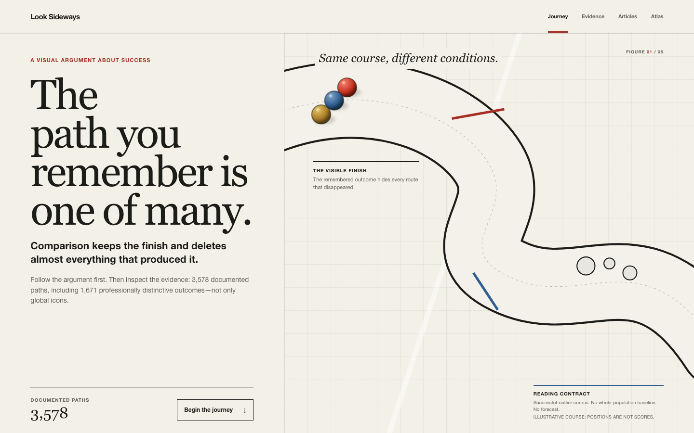

# Look Sideways

**Look sideways for information, never for a verdict.**

<!-- dataset-summary:start -->
A guided, evidence-led journey through 3,578 early-breakthrough paths: what
people brought, were handed, and were surrounded by, with perseverance, luck,
and the limits of comparison kept visible.
<!-- dataset-summary:end -->

[](https://github.com/Significant-Hobbies/what-it-takes-to-win/actions/workflows/ci.yml)
[](https://paths.significanthobbies.com)
[](docs/architecture.md)
[](docs/README.md)

[](https://paths.significanthobbies.com)

Look Sideways is a public research exhibit. It exists for the moment when
someone turns another person's visible success into a judgement about their own
pace, ability, or worth. The site walks that reader through why the comparison
fails as a verdict, then lets them inspect the evidence behind every claim.

Made by [Sarthak Agrawal](https://sarthakagrawal.dev) under
[Significant Hobbies](https://significanthobbies.com). Read the
[project brief](docs/brief.md) if you are new here and want the whole picture
in five minutes.

## The argument in one paragraph

Every person in the archive reached a documented breakthrough early, so the
selection starts after the outcome is already known. Each path is then read
through three separate sources of advantage: what the person brought, what they
were handed, and what surrounded them. Perseverance appears only where sources
document it. Luck stays visible and unscored. The three factors are never added
into a single score, because a total would be one more number to rank people
by, and ranking is the reading this project refuses.

## What is in the exhibit

- A five-chapter guided journey on the homepage, drawn as a scroll-driven
  marble course where three marbles trade the lead as the terrain changes.
- 3,578 source-linked profiles across founders, athletes, creators, and
  researchers, each led by the three condition factors.
- An explore atlas with search, cohort, category, outcome-reach, and sort
  controls.
- Person-specific comparison breakers that show conditions, sequence, and luck
  instead of a resemblance score.
- An evidence room, a live coverage ledger, a full methodology page, and two
  long-form essays.
- A local-only expected-value and ROI worksheet that never transmits input.
- Agent and search surfaces: sitemap, Markdown mirrors of every page,
  `llms.txt`, `/api/ai`, `/openapi.json`, and JSON-LD.

The full route list lives in [docs/surfaces.md](docs/surfaces.md).

## What it is not

The exhibit makes no causal claim that an advantage produces success. It does
not predict individual outcomes, rank human worth, or claim complete capture of
a population. It is an explanatory research surface, and its limitations are
published next to the evidence they qualify.

## Quick start

```bash
pnpm install
pnpm run dev          # Astro dev server on http://localhost:4321
pnpm run check        # rebuild dataset artifacts and typecheck
pnpm run build        # full static build plus discovery surfaces
pnpm run quality      # the complete release gate CI runs
```

The build reads the research corpus in `src/data/`, derives every figure the
site quotes, and emits a static site to `dist/`. Node 22 and pnpm 10 are the
tested versions. Python 3 is only needed for the research pipeline scripts.

After a dataset change, run `pnpm run sync:stats` so the figures quoted in this
file and in `PROJECT_STATUS.md` are regenerated from the corpus. The quality
gate fails if they drift.

## Repository at a glance

| Path | What it holds |
|---|---|
| `src/pages/` | The Astro routes for every public surface |
| `src/data/` | The published corpus, taxonomies, data dictionary, and methodology |
| `src/lib/` | Pure model code: outcome bands, coverage, ROI, contribution validation |
| `src/scripts/` | Build, audit, sync, and research pipeline scripts |
| `data/research/` | Candidate queues, batch prompts, and raw research results |
| `artifacts/` | Founder discovery runs, scoring batches, and design evidence |
| `quality/` | Reliability and source-audit reports with their raw data |
| `docs/` | Architecture, decisions, lessons, glossary, and the project brief |
| `test/` | Node test suite for the model code |

A folder-by-folder guide is in [docs/repo-map.md](docs/repo-map.md).

## Documentation

Start at [docs/README.md](docs/README.md). The most useful entry points:

- [Project brief](docs/brief.md) for anyone meeting the project for the first time
- [FAQ](docs/faq.md) for the questions the exhibit gets asked most
- [Glossary](docs/glossary.md) for the project's vocabulary
- [Architecture](docs/architecture.md) for how the build turns a corpus into a site
- [Dataset](docs/dataset.md) and [research pipeline](docs/research-pipeline.md) for how people enter the archive
- [Quality gates](docs/quality-gates.md) for what the release gate checks
- [Decision log](docs/decision-log.md) and [lessons](docs/lessons.md) for the journey so far

Product and design context that agents and contributors read first:
[PRODUCT.md](PRODUCT.md), [DESIGN.md](DESIGN.md), [AGENTS.md](AGENTS.md), and
[PROJECT_STATUS.md](PROJECT_STATUS.md).

## Contributing

Suggest a missing person or propose a correction at
[/contribute/](https://paths.significanthobbies.com/contribute/), or open a
GitHub issue with one of the templates. Code contributions follow
[CONTRIBUTING.md](CONTRIBUTING.md). Open work is tracked only in
[GitHub Issues](https://github.com/Significant-Hobbies/what-it-takes-to-win/issues).

## Licence

Release terms for the original annotations and scripts are still under review.
The repository does not yet grant a licence. Third-party sources, including
Wikipedia, Pantheon, and every linked URL, keep their own terms. See
[src/data/LICENSE_DATA.md](src/data/LICENSE_DATA.md) for the suggested terms
and attribution.
