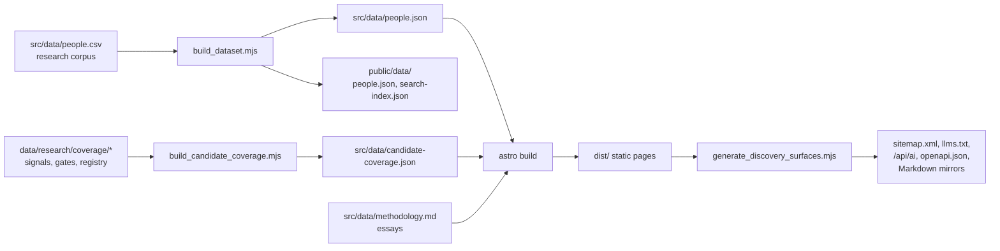

# Architecture

Look Sideways is a static site. A research corpus in the repository is turned
into thousands of pre-rendered pages at build time and served from Cloudflare
Pages. There is no database, no user account, and no server-side rendering.

## Stack

| Layer | Choice | Why |
|---|---|---|
| Framework | Astro 7 | Static output, Markdown pages, zero client JS by default |
| Charts | ECharts 6 | Split by visualization family, loaded when charts approach the viewport |
| Hosting | Cloudflare Pages, project `success-by-26` | Static files plus one Pages Function for content negotiation |
| Language | TypeScript for model code, JavaScript for build scripts, Python for research tooling | Model code is tested; research scripts are batch tools |
| Lint | Ultracite on Biome 2 | The Fleet lint contract, run through `pnpm run lint` |
| Tests | Node's built-in test runner | No framework dependency for four pure-model test files |
| Package manager | pnpm 10 | Pinned in `package.json` for CI |

## Build pipeline



`pnpm run build` runs these four steps in order. The dataset builder validates
the corpus as it goes: unique IDs, scores in range, no missing key fields,
deduplicated source URLs, and source counts derived from the published arrays.
A malformed record fails the build rather than shipping.

## Where the numbers come from

Every figure the site quotes is derived from `people.json` at build time. The
homepage total, the reach-band counts, the coverage ledger, the sitemap size,
and the JSON-LD dataset description all read the same array. The figures quoted
in `README.md` and `PROJECT_STATUS.md` are the one exception, and those are
regenerated by `sync_dataset_stats.mjs` and checked in the quality gate.

## Source layout

```
src/
  pages/        one folder per public route; person/[id] and am-i-the-next/[id] are dynamic
  layouts/      Base.astro (shell, nav, footer, analytics) and Essay.astro
  lib/          pure model code: outcome-model, journey-model, coverage, roi, contribution, discovery
  scripts/      build, audit, sync, render, and research pipeline scripts
  styles/       one stylesheet per surface family plus global.css
  data/         corpus, taxonomies, data dictionary, methodology, licence note
```

Model code in `src/lib/` has no DOM dependency and is covered by `test/`. Pages
import from it and render. Client-side scripts are limited to the chart runtime,
the explore atlas, the nav search, the ROI calculator, and the scroll mapping
for the marble course.

## Runtime behaviour

The homepage marble course is an inline SVG that is complete without script.
Script only maps native scroll progress to SVG positions and the active chapter
annotation. It never intercepts scrolling or runs an idle animation loop, and
reduced-motion readers get a static race state with the same argument.

The explore atlas fetches `public/data/people.json` on first use. The nav
search fetches a slim `search-index.json` on first focus. Charts register only
the ECharts modules each surface needs and initialise when they near the
viewport.

## Agent and search surfaces

`generate_discovery_surfaces.mjs` runs after the Astro build and emits:

- `sitemap.xml` with one URL per core surface, essay, person, and evidence-gated
  comparison page
- a noindex Markdown mirror for every canonical URL
- `llms.txt` and `llms-full.txt`
- `/api/ai`, a catalog of seven concrete surfaces and two templated collections
- `/openapi.json` describing the catalog

`functions/_middleware.ts` is the single Pages Function. It serves the Markdown
mirror when a request prefers `text/markdown`, sets `Vary: Accept`, and returns
JSON or Markdown 404s to agents. It must not shadow the static files above,
because `audit_discovery.mjs` verifies them from `dist/`.

## Analytics boundary

The shared layout loads PostHog page views, a Microsoft Clarity project, and the
App Health browser event log. The `/roi/` worksheet is excluded from session
replay so user-supplied inputs stay out of recordings. The footer discloses the
boundary.

## Deploy

`pnpm run deploy` runs the full quality gate and then publishes `dist/` with
Wrangler to the Pages project. CI runs the same gate on every push and pull
request but does not deploy. Deploys are manual and only from a clean `main`.

## Related pages

- [Public surfaces](surfaces.md) lists every route.
- [Quality gates](quality-gates.md) explains each check in the gate.
- [DESIGN.md](../DESIGN.md) is the visual system the pages implement.
