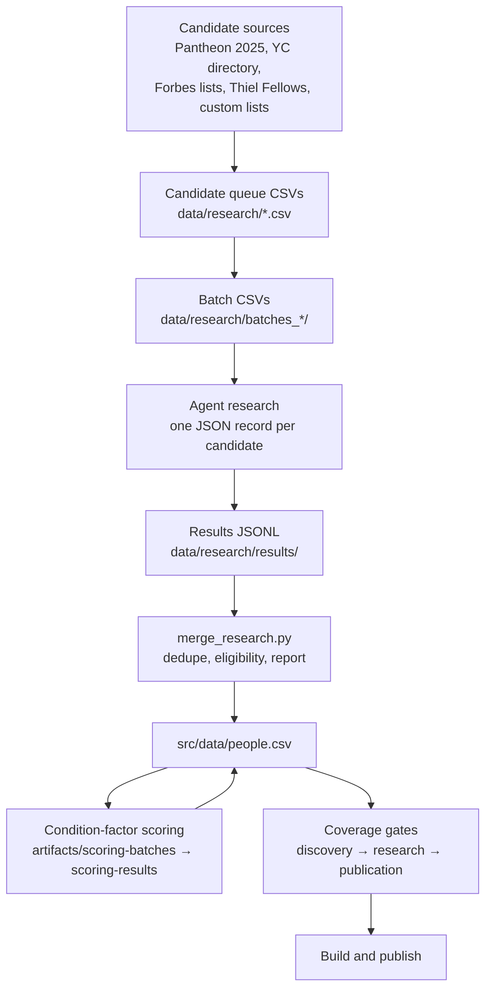

# Research pipeline

How a name becomes a published profile. The pipeline was built to be run by
coding agents in small batches with a human reviewing the merges. The research
instructions that each batch follows are in
[data/research/RESEARCH_INSTRUCTIONS.md](../data/research/RESEARCH_INSTRUCTIONS.md).

## Overview

## 1. Discover candidates

Candidate queues come from several sources, each with its own builder script
in `src/scripts/`:

- Pantheon 2025 for globally notable people, filtered to those born in 1950 or
  later and likely to have an early milestone.
- A tech and founder queue built from Pantheon plus custom lists.
- The Y Combinator company directory, scraped and merged by the scripts in
  `scripts/research/`, which produced the 2026-08-19 founder expansion.
- Forbes 30 Under 30, Thiel Fellows, unicorn founders, and young athletes,
  creators, and researchers from the 1990s and 2000s, held in
  `artifacts/other-founder-research/`.

Queues are written as CSVs in `data/research/` and split into batch files of
twelve names each.

## 2. Research a batch

An agent receives one batch CSV and the research instructions. For each person
it must decide whether a material, independently verifiable milestone happened
at or before the target age. The rules that matter most:

- Eligibility first. If no dated milestone can be sourced, the person is marked
  ineligible. Later fame does not count.
- Two sources minimum for the milestone date.
- Family background is never invented. Without source-backed evidence the score
  is zero, which means no clear evidence, not absence.
- Scores are conservative interpretive annotations.
- Every person gets a row, including ineligible ones.

Output is one JSON object per person in a JSONL file under
`data/research/results/`. There are 621 result files from the batch families
listed in the [repository map](repo-map.md).

## 3. Merge

`merge_research.py` reads the results, skips duplicates against the existing
corpus, separates eligible from ineligible records, and writes eligible ones
into `people.csv`. It also writes `merge_report.json` with counts of existing,
eligible, ineligible, duplicate, and errored records. The most recent report
shows 43 eligible additions against 3,317 ineligible and 4,008 duplicates
skipped, which is the expected shape once the obvious candidates are already in.

Related merge scripts handle trajectory deepening batches, category
normalisation, source backfill, and provenance stamping.

## 4. Score the condition factors

The three condition factors were scored in a separate pass over the whole
corpus in August 2026. `scripts/research/build_scoring_batches.mjs` split the
corpus into batches in `artifacts/scoring-batches/`, agents scored each batch
against the prompt in `artifacts/scoring-prompt.md`, and
`apply_3d_scores.mjs` wrote the results back. A heuristic pre-scorer flagged
records that needed full research, and 427 thin-evidence records went through
a verification pass with rescoring.

## 5. Pass the coverage gates

Since 2026-08-26 new admissions pass three versioned verdicts defined in
`data/research/coverage/gate-registry.json`:

1. Discovery checks identity, a valid event date, conservative age, typed
   metrics, and source provenance. A new event type can clear discovery so it
   is not lost, but cannot clear research until a field rule is reviewed.
2. Research requires an age-banded outcome rule for the field, an independently
   useful source role, and two evidence origins. Two domains repeating one
   announcement do not count as independent.
3. Publication reproduces identity, field, age, source preservation, and the
   qualifying trajectory event against the completed record.

A researcher writing `eligible` on a record does not bypass the gates. The
current age-banded thresholds are labelled provisional research screens, not an
audited top-0.001 percent claim. A gold set of five known people must resolve
to the expected state on every build.

## 6. Audit and publish

`audit_sources.mjs` fetches any source URL not seen before and stores the
result on the record. `pnpm run sync:stats` regenerates the quoted figures. The
full quality gate runs, and the site is deployed manually.

## Contribution path

Readers can nominate a person or propose an edit at `/contribute/`. The form
validates the input, shows exactly what GitHub will receive, and opens a
pre-filled issue. A suggestion enters the candidate funnel; it does not skip
any gate.

## Scale so far

| Stage | Count |
|---|---|
| Result files researched | 621 |
| Founder records considered in the YC expansion | 2,205 |
| Founder records published from it | 837 |
| Published profiles | 3,578 |
| Source URLs listed | 12,682 |

The candidate ledger in `artifacts/coverage/candidate-ledger.jsonl` and the
live `/coverage/` page report the queue that remains.
