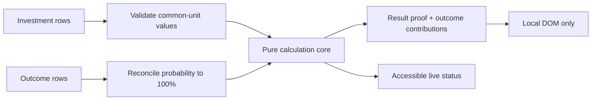

<!--
THESIS: ROI becomes trustworthy only when every assumption reconciles; this surface refuses the opaque scorecard.
OWN-WORLD: The existing dark evidence system becomes a ruled decision ledger with ink-blue actions, mint-valid states, amber warnings, and border-only panels.
STORY: Name the action, value and allocate the effort, enumerate possible returns, reconcile probability to 100%, then inspect the arithmetic and its limits.
FIRST VIEWPORT: A compact definition band leads directly into a blank assumption ledger at left and a sticky incomplete proof at right; the primary action is entering the user's first real investment, with a synthetic example kept secondary.
FORM: Candidate 5, “reconciled worksheet,” from the ordered surface structures; staged as a simultaneous ledger and proof sheet; seed key `roi-lab`.
-->

## Context

See `proposal.md` for motivation. The site is a static Astro research exhibit
with an established dark, evidence-led visual system, no client framework, and
build-generated public discovery files. Existing quantitative surfaces keep
definitions and limits adjacent to their measures and avoid prediction claims.

The requested tool must combine time, money, and resources without committing
the dimensional error of adding unlike units. It must also distinguish total
outcome value from profit and expected value from a likely single outcome.

## Goals / Non-Goals

**Goals:**

- Keep every probability and valuation editable, visible, and user supplied.
- Show how total effort is allocated across foundation, capability-building, and
  final-mile work without using allocation as a proxy for merit or intensity.
- Isolate calculation logic from DOM behavior so formulas are directly tested.
- Make reconciliation to 100% and the path from expected value to ROI obvious.
- Preserve semantic HTML, keyboard access, narrow-screen use, and static hosting.

**Non-Goals:**

- Estimate probabilities, recommend whether to proceed, or personalize a risk
  tolerance.
- Add discounted cash flow, annualized ROI, NPV, utility curves, correlated
  outcomes, or multi-period scenario trees in the first version.
- Persist worksheets, synchronize them across devices, or add share links.

## Decisions

### Use a common-unit investment ledger

Each investment row records category, label, quantity, and value per quantity.
The row subtotal is their product. This supports inputs such as hours times an
hourly value, cash times one, or equipment months times monthly cost while
making the conversion assumption explicit.

Alternatives considered: a single total-investment input is simpler but hides
the time/resource valuation; independently summing dollars and hours produces a
dimensionally invalid ROI.

### Separate effort stage from effort type

Investment type answers what was spent: time, money, or a resource. Effort
stage answers where it was spent: building the foundation, building or
converting capability, or executing the final mile. Keeping both fields avoids
calling access-building work unproductive while revealing the user's actual
allocation.

The result sheet shows three proportional segments and values. A nearby
same-total illustration contrasts a foundation-heavy path with a final-mile-
heavy path and states that it is a conceptual example, not an estimate of any
person. No stage changes the ROI formula; every line item remains in the total
investment denominator.

### Model outcomes as total gross value

Each outcome stores a label, probability percentage, and total value received
if it occurs. Expected net return subtracts investment once, after the weighted
gross values are summed. Negative outcome values remain allowed for cases with
additional liability.

Alternatives considered: asking for profit per outcome shortens the formula but
makes the denominator and investment recovery ambiguous; separate revenue and
cost fields would add false precision to a focused worksheet.

### Keep the calculation core pure

A small TypeScript module owns validation and arithmetic for investment rows,
outcomes, expected value, net return, ROI, multiple, downside probability, and
break-even-or-better probability. The route's browser script owns row editing,
formatting, DOM updates, and reset confirmation.

No client framework or charting library is needed. CSS bars communicate
probability, weighted contribution, and effort allocation, keeping the initial
bundle and runtime surface small.

### Use the reconciled-worksheet structure

Seven grounded structures were considered in resonance order: split decision
ledger, probability tree, balance scale, investment-to-outcome flow, reconciled
worksheet, outcome fan, and step-by-step wizard. The externally assigned fifth
structure is a ruled worksheet whose result becomes final only when the
probability checksum reaches 100%.

The challengers supplied by the design seed—wound-medium transport, landmark
horizon, and verdict run—were rejected because they hide simultaneous outcome
comparison or make ordinary form editing unfamiliar. The selected structure
extends the current evidence-led visual system and keeps the task in one view:
desktop uses a wide editable ledger plus sticky proof sheet; narrow screens
stack the proof immediately after the probability status. The initial state is
blank and instructional. A secondary action loads a clearly fictional example;
clear-all returns to the blank state after confirmation.

### Treat invalid input as an incomplete proof, not a guessed answer

The UI shows the probability total, gap/excess, row-level problems, and the
reason ROI is unavailable. It does not silently normalize probabilities or
coerce a zero investment. A tolerance of 0.01 percentage points handles normal
decimal entry while calculation still uses the entered values.

### Extend the existing discovery generator

`/roi/` joins the `coreSurfaces` source used for sitemap routes, Markdown
mirrors, `llms.txt`, and `/api/ai`. Its static Markdown explains formulas and
limitations; it does not pretend the interactive worksheet works without
JavaScript.

## Risks / Trade-offs

- [Users compare unlike units] → Put the common-unit rule above the first row,
  repeat it in the interpretation note, and make the selected unit visible in
  every value column.
- [Expected ROI is mistaken for the most likely result] → Pair the headline
  result with downside probability, the full outcome list, and an explicit
  repeated-decision explanation.
- [The allocation chart is read as a work-ethic score] → Keep every stage in the
  denominator, label the view “where effort goes,” and explicitly state that it
  does not measure intensity, merit, or anyone else's undocumented work.
- [A large number of rows becomes hard to scan on phones] → Use labelled row
  cards below the content-driven breakpoint and keep remove actions adjacent to
  their row.
- [Frequent input events create noisy announcements] → Update visible values on
  input but announce only reconciliation and validity state changes through a
  polite live region.
- [Negative values produce confusing bars] → Use probability-length bars and
  print signed contribution values instead of plotting a misleading shared
  magnitude scale.

## Migration Plan

Ship the route and discovery additions as static files. Rollback removes the
route, navigation entry, and `coreSurfaces` record; there is no stored data,
schema migration, backend, or production dependency to unwind.
