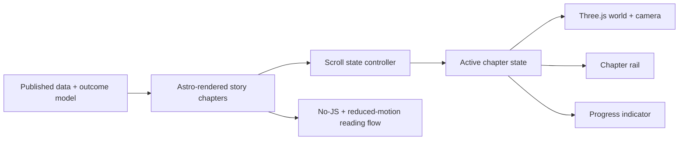

## Context

See `proposal.md` for motivation. The site is a static Astro research exhibit
with an established evidence-led editorial system, build-derived data, local
runtime assets, reduced-motion support, and no client framework. Owner feedback
rejected the first dark archive treatment and explicitly made the story the
landing page. The former homepage remains available as `/overview/`.

The Kage build prompt is an interaction reference for continuous scroll,
composed chapters, active navigation, atmospheric depth, and a persistent 3D
world. Expeditione and Resn provide additional quality references for crisp
geometry, clear silhouettes, and disciplined runtime delivery. Their brand
language, code, and artwork are not part of this product. The selected world is
the Impossible Observatory: a bright stone-and-brass research monument whose
glass paths make alternative trajectories spatially legible.

## Goals / Non-Goals

**Goals:**

- Create a persuasive landing route whose five chapters map directly to the existing
  explanatory model and survivor-path argument.
- Make the active chapter legible through one coordinated procedural 3D world,
  scroll camera, progress rail, and chapter state.
- Derive displayed measures from the same JSON and outcome-model utilities as
  the rest of the site.
- Preserve semantic order, keyboard navigation, reduced-motion behavior, and
  responsive readability.

**Non-Goals:**

- Remove the evidence-dense overview; it moves intact to `/overview/`.
- Add remote fonts, remote models, copied reference artwork, or remote runtime
  assets.
- Introduce new causal claims, scores, personalized predictions, or a backend.

## Decisions

### Make the story the canonical landing page

The owner explicitly selected the story as the landing page after rejecting
the optional dark-archive route. `/` now owns the cinematic journey, while the
existing evidence-dense homepage moves to `/overview/`. `/story/` redirects to
`/` so older links converge on one canonical experience.

### Use the owner-selected Impossible Observatory

One transparent WebGL canvas contains a connected 160-metre observatory campus:
a monumental orrery, unequal terraces, a mechanical leverage instrument, a
suspended sequence bridge, and an open uncertainty sphere. Pale stone,
polished brass, clear glass, cobalt trajectory light, sharp daylight, and
strong silhouettes replace the rejected muddy night archive. The live world is
the primary experience and remains spatially continuous through camera travel,
rotating instruments, moving markers, fog, particles, and responsive glass
paths. Five original project-specific plates are local optimized fallbacks for
reduced motion, constrained devices, or WebGL failure; they are not copied or
remote artwork.

Three.js is the single new production dependency. The renderer caps pixel
density, uses instancing for repeated forms, pauses when the document is hidden,
and falls back to the server-rendered DOM/SVG composition if WebGL is missing,
fails, or reduced motion is requested.

### Treat JavaScript as a state synchronizer and scene controller

Chapter geometry selects the section nearest a stable viewport focus line;
scroll position updates overall progress and the camera target. The script
coordinates attributes, ARIA state, and the Three.js controller without
rebuilding layout. All copy, links, diagrams, and anchors work before it runs.

### Keep the five chapters factual and asymmetrical

The sequence is: the visible survivor, the starting position, multiplied
capacity, compounding trajectory, and the luck/agency boundary. Each chapter
uses a different evidence form rather than repeating equal cards. The final
chapter links to Explore, Evidence, and a named-person comparison so the story
ends in inspection rather than inspiration.

### Include Story in existing discovery generation

The new route joins `coreSurfaces`, which already drives sitemap, Markdown,
agent catalog, and link lists. Audit expectations derive from that list or are
updated to its new count so generation and verification stay aligned.

## Risks / Trade-offs

- [A fixed full-viewport canvas can obscure content on short or mobile
  viewports] → Keep copy in normal document flow, apply a strong directional
  wash behind text, and retain the static DOM/SVG fallback.
- [Atmospheric motion can weaken the evidence-first register] → Use only model
  primitives, restrained existing tokens, and adjacent interpretation labels;
  no decorative stock assets or glow-led copy hierarchy.
- [WebGL can fail or consume excessive GPU resources] → Cap device pixel ratio,
  use instanced geometry, pause off-tab rendering, handle context loss, and
  leave the semantic fallback intact.
- [Scroll observers can disagree around chapter boundaries] → Observe chapter
  centers with stable root margins and keep the current chapter until the next
  section crosses the threshold.
- [A new canonical route can drift from discovery counts] → Extend the current
  single `coreSurfaces` source and run the discovery audit after build.

## Migration Plan

Ship as a static landing-route replacement with the former homepage preserved
at `/overview/`. Rollback consists of swapping those route wrappers back; no
stored data or schema migration is involved.
